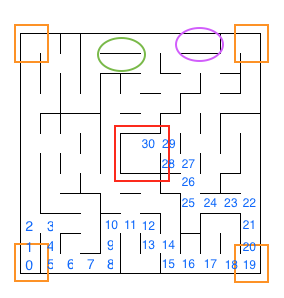

# Machine Learning Engineer Nanodegree
## Capstone Project
Mathias von Kaiz  
August 1st, 2017

## I. Definition
_(approx. 1-2 pages)_

### Project Overview
This project is based on the Micromouse competition in which a small robot mouse needs to solve a virtual maze. This means that the mouse needs to find a way from the starting position to a defined destination position (e.g center of maze or exit) completely by its own.

The goal is to reach the destination point as fast as possible. This project covers all relevant technical steps for a simulated virtual robot mouse to achieve this goal in a virtual maze.

### Problem Statement
_In this section, you will want to clearly define the problem that you are trying to solve, including the strategy (outline of tasks) you will use to achieve the desired solution. You should also thoroughly discuss what the intended solution will be for this problem. Questions to ask yourself when writing this section:_
- _Is the problem statement clearly defined? Will the reader understand what you are expecting to solve?_
- _Have you thoroughly discussed how you will attempt to solve the problem?_
- _Is an anticipated solution clearly defined? Will the reader understand what results you are looking for?_

----

The simulated virtual robot mouse and the virtual maze are given as a simplified model (code base). So what is left for the problem statement is the question, what needs to be done that the mouse finds the fastest way to a defined destination? 

To find an optimal (and fastest way) to the destination the mouse needs to perform two runs from starting location to final destination. On the first run the robot is allowed to explore the environment and create a map of the maze. It needs to find the goal in this attemp but it still can explore the environment afterwards. In the second run the robot starts again from starting point and hast to find the goal as fast as possible.

Steps to take and how to achieve
- Find the goal -> Localization and motion (in the first run)
- Get to know the structure of the maze -> Filters (first and several other runs)
- Evaluate best paths -> Search, Control

--> Functions, logic and model for learning from several runs

**
- It needs to know the sturcture of the maze, so it will map the maze (walls, paths, deadends) until it finds the defined destination.
- After that the mouse will peform several runs from the starting point to explore the best and fastest pathes available. the mouse uses what it has learned from the runs before. **

### Metrics
In this section, you will need to clearly define the metrics or calculations you will use to measure performance of a model or result in your project. These calculations and metrics should be justified based on the characteristics of the problem and problem domain. Questions to ask yourself when writing this section:
- _Are the metrics you’ve chosen to measure the performance of your models clearly discussed and defined?_
- _Have you provided reasonable justification for the metrics chosen based on the problem and solution?_

----

Since the robot mouse is expected to find the destination spot as fast as possible (having only two runs) the evaluation of the score will be on one important metric -> needed time steps. The rules allow two runs only and that the robot can explore the maze in the first run as long as it wants (maximum of 1000 steps for first and second run together). Therefore the second run is the main scoring run meaning that each time step in the second run counts as one. The first run is considered one thirtieth the number of time steps needed additionaly.

In my opinion for this scenario there is no need regard other metrics. We have a clear defined rule set and a clear defined goal. We don't need to evaluate other metrics like safety or realibility (as for the smartcab scenario). If the robot is driving into a wall it increases the needed points and has therefor already a penalty on scoring. It also has to reach the goal in the given time frame (1000 steps) otherwise it was not successful. 

## II. Analysis
_(approx. 2-4 pages)_

### Data Exploration
In this section, you will be expected to analyze the data you are using for the problem. This data can either be in the form of a dataset (or datasets), input data (or input files), or even an environment. The type of data should be thoroughly described and, if possible, have basic statistics and information presented (such as discussion of input features or defining characteristics about the input or environment). Any abnormalities or interesting qualities about the data that may need to be addressed have been identified (such as features that need to be transformed or the possibility of outliers). Questions to ask yourself when writing this section:
- _If a dataset is present for this problem, have you thoroughly discussed certain features about the dataset? Has a data sample been provided to the reader?_
- _If a dataset is present for this problem, are statistics about the dataset calculated and reported? Have any relevant results from this calculation been discussed?_
- _If a dataset is **not** present for this problem, has discussion been made about the input space or input data for your problem?_
- _Are there any abnormalities or characteristics about the input space or dataset that need to be addressed? (categorical variables, missing values, outliers, etc.)_

----

The project is based on three test mazes each represented by an even grid of squares. Each maze is fully surrounded by walls. Beside the outside walls each square can have multiple walls that block movement. Starting point is always placed in the bottom-left corner and has a right, a bottom and a left wall opened to the top. The robot will start facing upwards. The goal room is placed inside the center of the maze and has a size of 2x2 squares.

The dataset for this project is delivered in 3 comma seperated text files defining the test mazes. 
First line of the dataset defines the number of squares for witdh and height of the maze.
- First maze consists of 12x12 squares
- Second maze consist of 14x14 squares
- Third maze consists of 16x16 squares

Each comma seperated cell in the following lines describe the nature of each cell in terms of walls and openings. Here a four-bit number system is used where a closed wall is represented by 0 and an opening is represented by 1. The first row defines the bottom line of the maze whereas the last row of the text file defines the upper line of teh maze. First number of each row represents the left most square whereas the last number of the row defines the right most square of the cell.

There are in total four registers (bit system) that defines each direction:
- 1st register defines up
- 2nd register defines right
- 4th register defines bottom
- 8th register defines left

For example, if we have a number 10 in the text file this means that this square has openings on the left and right side
(10 = 0*1 + 1*2 + 0*4 + 1*8).
Starting point has a 1 as we only have an opening upwards (1 = 1*1 + 0*2 + 0*4 + 0*8)

### Exploratory Visualization
In this section, you will need to provide some form of visualization that summarizes or extracts a relevant characteristic or feature about the data. The visualization should adequately support the data being used. Discuss why this visualization was chosen and how it is relevant. Questions to ask yourself when writing this section:
- _Have you visualized a relevant characteristic or feature about the dataset or input data?_
- _Is the visualization thoroughly analyzed and discussed?_
- _If a plot is provided, are the axes, title, and datum clearly defined?_

-----

Based on the description about the dataset in the chapter before you can see the mapping from bit-wise numbering to maze structure:

Maze 1 Structure | Maze 1 Plot 
--- | --- 
| 

Maze 2 Structure | Maze 2 Plot 
--- | --- 
| 

Maze 3 Structure | Maze 3 Plot 
--- | --- 
| 

You can see that the number data reflects the similar structure on striking spots. For example the edges are having all the same structure and shape so we can see same number in the structure files -> orange spots.
In the red shaped areas you can see the according walls and opening definitions for the center 2x2 goal square (*left and right side are same in text and plot but top and bottom are vice versa in text structure file*).

### Algorithms and Techniques
In this section, you will need to discuss the algorithms and techniques you intend to use for solving the problem. You should justify the use of each one based on the characteristics of the problem and the problem domain. Questions to ask yourself when writing this section:
- _Are the algorithms you will use, including any default variables/parameters in the project clearly defined?_
- _Are the techniques to be used thoroughly discussed and justified?_
- _Is it made clear how the input data or datasets will be handled by the algorithms and techniques chosen?_

### Benchmark
In this section, you will need to provide a clearly defined benchmark result or threshold for comparing across performances obtained by your solution. The reasoning behind the benchmark (in the case where it is not an established result) should be discussed. Questions to ask yourself when writing this section:
- _Has some result or value been provided that acts as a benchmark for measuring performance?_
- _Is it clear how this result or value was obtained (whether by data or by hypothesis)?_

## III. Methodology
_(approx. 3-5 pages)_

### Data Preprocessing
In this section, all of your preprocessing steps will need to be clearly documented, if any were necessary. From the previous section, any of the abnormalities or characteristics that you identified about the dataset will be addressed and corrected here. Questions to ask yourself when writing this section:
- _If the algorithms chosen require preprocessing steps like feature selection or feature transformations, have they been properly documented?_
- _Based on the **Data Exploration** section, if there were abnormalities or characteristics that needed to be addressed, have they been properly corrected?_
- _If no preprocessing is needed, has it been made clear why?_

### Implementation
In this section, the process for which metrics, algorithms, and techniques that you implemented for the given data will need to be clearly documented. It should be abundantly clear how the implementation was carried out, and discussion should be made regarding any complications that occurred during this process. Questions to ask yourself when writing this section:
- _Is it made clear how the algorithms and techniques were implemented with the given datasets or input data?_
- _Were there any complications with the original metrics or techniques that required changing prior to acquiring a solution?_
- _Was there any part of the coding process (e.g., writing complicated functions) that should be documented?_

### Refinement
In this section, you will need to discuss the process of improvement you made upon the algorithms and techniques you used in your implementation. For example, adjusting parameters for certain models to acquire improved solutions would fall under the refinement category. Your initial and final solutions should be reported, as well as any significant intermediate results as necessary. Questions to ask yourself when writing this section:
- _Has an initial solution been found and clearly reported?_
- _Is the process of improvement clearly documented, such as what techniques were used?_
- _Are intermediate and final solutions clearly reported as the process is improved?_

## IV. Results
_(approx. 2-3 pages)_

### Model Evaluation and Validation
In this section, the final model and any supporting qualities should be evaluated in detail. It should be clear how the final model was derived and why this model was chosen. In addition, some type of analysis should be used to validate the robustness of this model and its solution, such as manipulating the input data or environment to see how the model’s solution is affected (this is called sensitivity analysis). Questions to ask yourself when writing this section:
- _Is the final model reasonable and aligning with solution expectations? Are the final parameters of the model appropriate?_
- _Has the final model been tested with various inputs to evaluate whether the model generalizes well to unseen data?_
- _Is the model robust enough for the problem? Do small perturbations (changes) in training data or the input space greatly affect the results?_
- _Can results found from the model be trusted?_

### Justification
In this section, your model’s final solution and its results should be compared to the benchmark you established earlier in the project using some type of statistical analysis. You should also justify whether these results and the solution are significant enough to have solved the problem posed in the project. Questions to ask yourself when writing this section:
- _Are the final results found stronger than the benchmark result reported earlier?_
- _Have you thoroughly analyzed and discussed the final solution?_
- _Is the final solution significant enough to have solved the problem?_

## V. Conclusion
_(approx. 1-2 pages)_

### Free-Form Visualization
In this section, you will need to provide some form of visualization that emphasizes an important quality about the project. It is much more free-form, but should reasonably support a significant result or characteristic about the problem that you want to discuss. Questions to ask yourself when writing this section:
- _Have you visualized a relevant or important quality about the problem, dataset, input data, or results?_
- _Is the visualization thoroughly analyzed and discussed?_
- _If a plot is provided, are the axes, title, and datum clearly defined?_

### Reflection
In this section, you will summarize the entire end-to-end problem solution and discuss one or two particular aspects of the project you found interesting or difficult. You are expected to reflect on the project as a whole to show that you have a firm understanding of the entire process employed in your work. Questions to ask yourself when writing this section:
- _Have you thoroughly summarized the entire process you used for this project?_
- _Were there any interesting aspects of the project?_
- _Were there any difficult aspects of the project?_
- _Does the final model and solution fit your expectations for the problem, and should it be used in a general setting to solve these types of problems?_

### Improvement
In this section, you will need to provide discussion as to how one aspect of the implementation you designed could be improved. As an example, consider ways your implementation can be made more general, and what would need to be modified. You do not need to make this improvement, but the potential solutions resulting from these changes are considered and compared/contrasted to your current solution. Questions to ask yourself when writing this section:
- _Are there further improvements that could be made on the algorithms or techniques you used in this project?_
- _Were there algorithms or techniques you researched that you did not know how to implement, but would consider using if you knew how?_
- _If you used your final solution as the new benchmark, do you think an even better solution exists?_

-----------

**Before submitting, ask yourself. . .**

- Does the project report you’ve written follow a well-organized structure similar to that of the project template?
- Is each section (particularly **Analysis** and **Methodology**) written in a clear, concise and specific fashion? Are there any ambiguous terms or phrases that need clarification?
- Would the intended audience of your project be able to understand your analysis, methods, and results?
- Have you properly proof-read your project report to assure there are minimal grammatical and spelling mistakes?
- Are all the resources used for this project correctly cited and referenced?
- Is the code that implements your solution easily readable and properly commented?
- Does the code execute without error and produce results similar to those reported?
