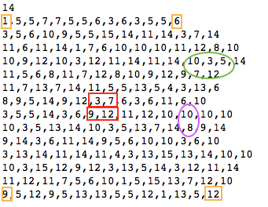
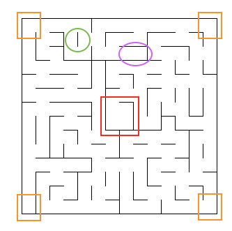
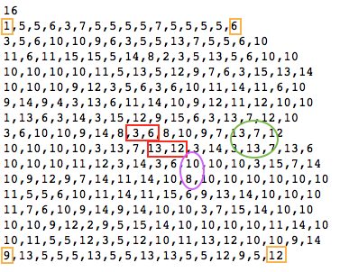

# Machine Learning Engineer Nanodegree
## Capstone Project, Plot and Navigate a Virtual Maze
Mathias von Kaiz  
August 1st, 2017

## I. Definition
_(approx. 1-2 pages)_

### Project Overview
This project is based on the Micromouse competition in which a small robot mouse needs to solve a virtual maze. This means that the mouse needs to find a way from the starting position to a defined destination position (e.g center of maze or exit) completely by its own.

The goal is to reach the destination point as fast as possible. This project covers all relevant technical steps for a simulated virtual robot mouse to achieve this goal in a virtual maze.

### Problem Statement
_In this section, you will want to clearly define the problem that you are trying to solve, including the strategy (outline of tasks) you will use to achieve the desired solution. You should also thoroughly discuss what the intended solution will be for this problem. Questions to ask yourself when writing this section:_
- _Is the problem statement clearly defined? Will the reader understand what you are expecting to solve?_
- _Have you thoroughly discussed how you will attempt to solve the problem?_
- _Is an anticipated solution clearly defined? Will the reader understand what results you are looking for?_

----

The simulated virtual robot mouse and the virtual maze are given as a simplified model (code base). So what is left for the problem statement is the question, what needs to be done that the mouse finds the fastest way to a defined destination? 

To find an optimal (and fastest way) to the destination the mouse needs to perform two runs from starting location to final destination. On the first run the robot is allowed to explore the environment and create a map of the maze. It needs to find the goal in this attemp but it still can explore the environment afterwards. In the second run the robot starts again from starting point and hast to find the goal as fast as possible.

Steps to take and how to achieve
- Find the goal
- Get to know the structure of the maze
- Evaluate best paths -> searching algorithms

To get as fast as possible to the destination the robot needs to perform steering and movement according to the calculated path based on the mapped maze.


### Metrics
In this section, you will need to clearly define the metrics or calculations you will use to measure performance of a model or result in your project. These calculations and metrics should be justified based on the characteristics of the problem and problem domain. Questions to ask yourself when writing this section:
- _Are the metrics you’ve chosen to measure the performance of your models clearly discussed and defined?_
- _Have you provided reasonable justification for the metrics chosen based on the problem and solution?_

----

Since the robot mouse is expected to find the destination spot as fast as possible (having only two runs) the evaluation of the score will be on one important metric -> needed time steps. The rules allow two runs only and that the robot can explore the maze in the first run as long as it wants (maximum of 1000 steps for first and second run together). Therefore the second run is the main scoring run meaning that each time step in the second run counts as one. The first run is considered one thirtieth the number of time steps needed additionaly.

In my opinion for this scenario there is no need regard other metrics. We have a clear defined rule set and a clear defined goal. We don't need to evaluate other metrics like safety or realibility (as for the smartcab scenario). If the robot is driving into a wall it increases the needed points and has therefor already a penalty on scoring. It also has to reach the goal in the given time frame (1000 steps) otherwise it was not successful. 


## II. Analysis
_(approx. 2-4 pages)_

### Data Exploration
In this section, you will be expected to analyze the data you are using for the problem. This data can either be in the form of a dataset (or datasets), input data (or input files), or even an environment. The type of data should be thoroughly described and, if possible, have basic statistics and information presented (such as discussion of input features or defining characteristics about the input or environment). Any abnormalities or interesting qualities about the data that may need to be addressed have been identified (such as features that need to be transformed or the possibility of outliers). Questions to ask yourself when writing this section:
- _If a dataset is present for this problem, have you thoroughly discussed certain features about the dataset? Has a data sample been provided to the reader?_
- _If a dataset is present for this problem, are statistics about the dataset calculated and reported? Have any relevant results from this calculation been discussed?_
- _If a dataset is **not** present for this problem, has discussion been made about the input space or input data for your problem?_
- _Are there any abnormalities or characteristics about the input space or dataset that need to be addressed? (categorical variables, missing values, outliers, etc.)_

----

The project is based on three test mazes each represented by an even grid of squares. Each maze is fully surrounded by walls. Beside the outside walls each square can have multiple walls that block movement. Starting point is always placed in the bottom-left corner and has a right, a bottom and a left wall opened to the top. The robot will start facing upwards. The goal room is placed inside the center of the maze and has a size of 2x2 squares.

The dataset for this project is delivered in 3 comma seperated text files defining the test mazes. 
First line of the dataset defines the number of squares for witdh and height of the maze.
- First maze consists of 12x12 squares
- Second maze consist of 14x14 squares
- Third maze consists of 16x16 squares

Each comma seperated cell in the following lines describe the nature of each cell in terms of walls and openings. Here a four-bit number system is used where a closed wall is represented by 0 and an opening is represented by 1. The first row defines the leftmost column of the maze whereas the last row of the text file defines the rightmost column of the maze. 

There are in total four registers (bit system) that defines each direction:
- 1st register defines up
- 2nd register defines right
- 4th register defines bottom
- 8th register defines left

For example, if we have a number 10 in the text file this means that this square has openings on the left and right side
(10 = 0*1 + 1*2 + 0*4 + 1*8).
Starting point has a 1 as we only have an opening upwards (1 = 1*1 + 0*2 + 0*4 + 0*8)

For additional input data the robot has three obstacles sensors in direction to right, left and upwards. These sensors can detect the number of open squares in each sensor direction or recognizes walls. On each time step the robot can rotate clockwise or counterclockwise for ninety degrees. After that it moves up to three squares in that or opposite (backwards) direction. After the movement the next time step starts and the sensors return new data.

Movement of the robot is assumed to be perfect (no path deviation) and if the robot moves into a wall it stays where it was.

Based on the robots behaviour you can see (numbers from 0 to 30 in Maze1 plot) that the minimum steps for the optimal path is 30 squares. As the robot can move 3 squares in one time step we get an optimal time period of 17 time steps to find the goal. 


### Exploratory Visualization
In this section, you will need to provide some form of visualization that summarizes or extracts a relevant characteristic or feature about the data. The visualization should adequately support the data being used. Discuss why this visualization was chosen and how it is relevant. Questions to ask yourself when writing this section:
- _Have you visualized a relevant characteristic or feature about the dataset or input data?_
- _Is the visualization thoroughly analyzed and discussed?_
- _If a plot is provided, are the axes, title, and datum clearly defined?_

-----

Based on the description about the dataset in the chapter before you can see the mapping from bit-wise numbering to maze structure:


Maze 1 Structure | Maze 1 Plot 
--- | --- 
| 


Maze 2 Structure | Maze 2 Plot 
--- | --- 
| 


Maze 3 Structure | Maze 3 Plot 
--- | --- 
| 


You can see that the number data reflects the similar structure on striking spots. For example the edges are having all the same structure and shape so we can see same number in the structure files -> orange spots.
In the red shaped areas you can see the according walls and opening definitions for the center 2x2 goal square (*The first row defines the leftmost column of the maze whereas the last row of the text file defines the rightmost column of the maze, so you can turn the structure file in an -90 degree angle to get the corresponding plot structure*).

In addition possible pitfalls could cause some unwanted behaviour to the agent. For example, the violet marked ovals represent dead ends where the robot can only move in one direction. Another pitfall could be that (green ovals) infinite loops could occur as the robot moves in circles. 

The handling of these pitfalls will be discussed in the next chapter.


### Algorithms and Techniques
In this section, you will need to discuss the algorithms and techniques you intend to use for solving the problem. You should justify the use of each one based on the characteristics of the problem and the problem domain. Questions to ask yourself when writing this section:

-----

This project is separated into two different phase. The first phase (Exploration) is to explore the maze with the goal to reach the defined destination. In the second phase (Search) the robot should calculate the shortest path and get to the destination as fast as possible.

For both phases i have defined different techniques and algorithms to accomplish each phase.

In Exploration Phase i tried out following techniques/algorithms:
- Random Move
- Recursive Move
- A Star / heuristic

Random Move just checks that it will not move into a wall. But there is not recording of former visited spots or dead ends. So the chance that the robot will get the destination is somehow small. As there is no tracking this technique is not useful to for search phase as it would not lead to desired results. This technique is the base to justfy that the movement and sensing is working properly.

Recursive Move is an adoption of the Recusrive Backtracker algorithm. As we do not have a fully explored Maze yet (that would enable us to use the recursive search algorith) i adopted the concept for exploring an unknown maze. We track all visited spots and do not visit these spots again. Alos the robot paints a line behind itself. If the robot reaches a dead end or a corner qhere he already visited all possible directions he will rease one sport behind him (and move back to this point and checks if there are still open spots. If not, he will again erase one spot behin him and move back and so on. This will be done until he reaches an open direction and proceed in this direction. It will reach the oal but not necessarily the fastest way.

A Star is somehow a heuristic apporach where it wants to take the shortest way (even if not explored yet). In case it can proceed (no wall) will follow the assumed shortest heuristic way. In case it cannot proceed it recalulates based on sensing which new direction to take and adjusts the new heuristic values to the new path. 

In Search Phase i tried out following techniques/algorithms
- Recursive Search
- A Star
- Dynamic Programming

Recursive Search is not fully implemented here (for the sake of simplicity). As i assum, that the recursive path is already taken (drawing lines behind itself and erasing dead end lines -> drawing new lins) we get a path to through the maze (assumed to be the same as having search recursively). So i only take the path tracked in Explore Phase and follow it. That is whay recursive search cannot be combined with other exploration techniques at the moment.

Dynamic Programming algorith is based on the Lecture of "Artifical Intelligence for Robotics" and just like A Star it gives the shortest path. It outputs from every location the shortest path to be taken. It can be used for every start location meaning that is suitable to react on different situations and changing starting locations (like in a self driving car). Is used this technique to be compared with A Star.


### Benchmark
In this section, you will need to provide a clearly defined benchmark result or threshold for comparing across performances obtained by your solution. The reasoning behind the benchmark (in the case where it is not an established result) should be discussed. Questions to ask yourself when writing this section:
- _Has some result or value been provided that acts as a benchmark for measuring performance?_
- _Is it clear how this result or value was obtained (whether by data or by hypothesis)?_

----

The different combinations of Explor and Search algorithm/techniques will be compared based on the reached score. For benchmark i assume to have A Star Exploration and A Star Search. This will be evaluated and proofed in a later chapter.


## III. Methodology
_(approx. 3-5 pages)_

### Data Preprocessing
In this section, all of your preprocessing steps will need to be clearly documented, if any were necessary. From the previous section, any of the abnormalities or characteristics that you identified about the dataset will be addressed and corrected here. Questions to ask yourself when writing this section:
- _If the algorithms chosen require preprocessing steps like feature selection or feature transformations, have they been properly documented?_
- _Based on the **Data Exploration** section, if there were abnormalities or characteristics that needed to be addressed, have they been properly corrected?_
- _If no preprocessing is needed, has it been made clear why?_

-----

As stated out in the Project Description we have perfection world, meaning perfect movement and perfect sensing. So i do not need to regard probabilities and techniques for acting on not perfect sensing and do not need to implement techniques to react on movement issues. This means that i do not have regarded Data Preprocessing.


### Implementation
In this section, the process for which metrics, algorithms, and techniques that you implemented for the given data will need to be clearly documented. It should be abundantly clear how the implementation was carried out, and discussion should be made regarding any complications that occurred during this process. Questions to ask yourself when writing this section:
- _Is it made clear how the algorithms and techniques were implemented with the given datasets or input data?_
- _Were there any complications with the original metrics or techniques that required changing prior to acquiring a solution?_
- _Was there any part of the coding process (e.g., writing complicated functions) that should be documented?_

--------

The code is structured into several python files. Following files are used for the project and will be sicussed briefly.
- globals.py - includes several helper variables and directories
- map.py - maps the maze and checks for unknown and permissable locations
- plan.py - main planner class including all relevant algorithm/techniques for exploring and searching
- robot.py - the main robot class and calculation the next move


```
# globals.py
dir_mazes = {'maze1': 'test_maze_01.txt',
            'maze2': 'test_maze_02.txt',
            'maze3': 'test_maze_03.txt'}
testmaze = Maze( str(dir_mazes[_maze]) )


#####################
_maze = 'maze1'
_timespan = 100
_maxtimespan = 1000

_init = [0, 0]
_distance = [0, 1, 2, 3]
_steering = ['left', 'front', 'right']
_dir_steering_to_rotation = {'left': -90, 'front': 0, 'right': 90}
_dir_steering_to_sensor_index = {'left': 0, 'front': 1, 'right': 2}

_dir_map_value = {'N': 1, 'E': 2, 'S': 4 , 'W': 8 }

_heading = ['u', 'r', 'd', 'l']
_dir_heading_to_map = {'u': 'N', 'r': 'E', 'd': 'S', 'l': 'W',
                       'up': 'N', 'right': 'E', 'down': 'S', 'left': 'W'}
_dir_int = {'u': 1, 'r': 2, 'd': 4, 'l': 8,
            'up': 1, 'right': 2, 'down': 4, 'left': 8}

_dir_heading_to_symbol = {'u': '^', 'r': '>', 'd': 'v', 'l': '<',
                          'up': '^', 'right': '>', 'down': 'v', 'left': '<'}


_dir_sensors = {'u': ['l', 'u', 'r'], 'r': ['u', 'r', 'd'],
               'd': ['r', 'd', 'l'], 'l': ['d', 'l', 'u'],
               'up': ['l', 'u', 'r'], 'right': ['u', 'r', 'd'],
               'down': ['r', 'd', 'l'], 'left': ['d', 'l', 'u']}
_dir_move = {'u': [0, 1], 'r': [1, 0], 'd': [0, -1], 'l': [-1, 0],
            'up': [0, 1], 'right': [1, 0], 'down': [0, -1], 'left': [-1, 0]}
_dir_steering_cost = {'u': 20, 'r': 20, 'd': 20, 'l': 20,
            'up': 20, 'right': 20, 'down': 20, 'left': 20}
_dir_reverse = {'u': 'd', 'r': 'l', 'd': 'u', 'l': 'r',
               'up': 'd', 'right': 'l', 'down': 'u', 'left': 'r'}
```

As you can see there are several directories used as helpers for transforming different states (e.g. Steering into direction or direction into movement). This helpers are used all over the projects code.


```
# map.py

class Map(object):
    def __init__(self, map_dim):
        '''
        Use the initialization function to set up attributes
        '''

        self.map_dim = map_dim
        self.grid = [[-1 for col in range(map_dim)] for row in range(map_dim)]
        self.visited = [[-1 for col in range(map_dim)] for row in range(map_dim)]
        self.moved = [[' ' for col in range(map_dim)] for row in range(map_dim)]
        
        
        
    def reset(self):
        '''
        Resets properties that are used in following runs
        '''
        
        self.visited = [[-1 for col in range(self.map_dim)] for row in range(self.map_dim)]
        self.moved = [[' ' for col in range(self.map_dim)] for row in range(self.map_dim)]
        
        
        
    def is_permissible(self, cell, direction):
        """
        Returns a boolean designating whether or not a cell is passable in the
        given direction. Cell is input as a list. Directions may be
        input as single letter 'u', 'r', 'd', 'l', or complete words 'up', 
        'right', 'down', 'left'.
        """
        
        if self.is_unknown(cell):
            return False
        
        try:
            return (self.grid[cell[0]][cell[1]] & globals._dir_int[direction] != 0)
        except:
            print cell, direction, ' is a wall!'
           
        
        
    def is_unknown(self, cell):
        '''
        Checks if a given cell is unknown (not yet explored/visited)
        '''
        
        return self.grid[cell[0]][cell[1]] == -1
        
        
        
    def expand(self, location, heading, sensors):
        '''
        Expand function that documents explored cells
        '''
        
        value = 0
        # check sensor steering
        for direction in globals._steering:
            if sensors[globals._dir_steering_to_sensor_index[direction]] > 0:
                i = globals._dir_map_value[globals._dir_heading_to_map[globals._dir_sensors[heading][globals._dir_steering_to_sensor_index[direction]]]]
                value += i
                
        # map reverse if not at starting position
        if (location != globals._init):
            value += globals._dir_map_value[globals._dir_heading_to_map[globals._dir_reverse[heading]]]
        
        # set value
        if self.grid[location[0]][location[1]] == -1:
            self.grid[location[0]][location[1]] = value
            
            
            
    def check_coverage(self):
        '''
        Calcluates the exploration coverage of the map
        '''
        unique, counts = np.unique(self.visited, return_counts=True)
        dir_coverage = dict(zip(unique, counts))
        total = np.prod(np.array(self.visited).shape)
        
        if float(dir_coverage[1]) / float(total) >= 0.7:
            return True
        else:
            return False 
```

The robot uses the map class to track the visited spots, checks wheather directions are permissable and where it already have moved and where not. This class is also used to calulate the total coverage of the map exploration.


```
# plan.py
# extraction
class Plan(object):
    
    def __init__(self, robot, cost = 1):
        '''
        Use the initialization function to set up attributes
        '''
        
        self.robot = robot
        self.map = robot.map
        self.grid_size = len(robot.map.grid[0])
        
        self.start = robot.get_start()
        self.init = robot.location
        self.set_goal()
        
        self.is_exploring = True
        self.is_goal_reached = False
        self.is_looking_for_start = False
        
        self.cost = cost
        self.make_heuristic()
        
        self.path = []
        self.path_to_goal = [] # used for some algorithms like recursive
        self.policy = []
        self.expand = []
       
    
    
    def reset(self):
        '''
        Resets properties that are used in following runs
        '''
        
        self.start = self.robot.get_start()
        self.init = self.robot.location
        self.set_goal()
        
        self.is_exploring = False
        self.is_goal_reached = False
        self.is_looking_for_start = False
        
        self.path = []
        self.policy = []
        self.expand = []
        
     
    
    def set_goal(self, goal_type='Goal'):
        '''
        Calculate goal function for a grid
        '''
        
        if goal_type == 'Goal':
            self.goal = [self.grid_size/2 - 1, self.grid_size/2]
        elif goal_type == 'Start':
            self.goal = self.robot.start
            
    
    
    def set_goal_reached(self):
        '''
        Calculated for goal reach
        '''
        
        self.is_goal_reached = self.robot.location[0] in self.goal and self.robot.location[1] in self.goal
    
    
    
    def set_steering_by_path(self, idx = 0):
        '''
        Returns steering angle for given heading
        '''
        
        steering = globals._steering[1]
        
        if len(self.path) > 0:
            try:
                for direction in globals._steering:
                    if globals._dir_sensors[self.robot.heading][globals._dir_steering_to_sensor_index[direction]] == self.path[idx]:
                        steering = direction
            except IndexError:
                print('--- No path segmet found ---')     
        else:
            print('--- No path found ---')
                    
        return steering
    
    
    
    def check_movement(self, path_step, heading):
        '''
        Checks if we need to do a reverse movement
        '''
        if globals._dir_reverse[heading] == path_step:
            return -1
        else:
            return 1
    
    
    
    def make_heuristic(self):
        '''
        Make heuristic function for a grid
        '''
        
        self.heuristic = [[0 for row in range(self.grid_size)] 
                          for col in range(self.grid_size)]
        
        for i in range(self.grid_size):    
            for j in range(self.grid_size):
                self.heuristic[i][j] = abs(i - self.goal[0]) + abs(j - self.goal[1])
```

```
# A Star 
def astar_search(self, init, is_path):
        '''
        A* search for goal
        '''
        
        # Init arrays
        closed = [[0 for col in range(self.grid_size)] for row in range(self.grid_size)]
        closed[init[0]][init[1]] = 1
        expand = [[-1 for col in range(self.grid_size)] for row in range(self.grid_size)]
        action = [[-1 for col in range(self.grid_size)] for row in range(self.grid_size)]

        # Init parameters
        x = init[0]
        y = init[1]
        g = 0
        h = self.heuristic[x][y]
        f = g + h

        found = False
        resign = False
        count = 0
        
        # Set open on beginning of algorithm
        open = [[f, h, g, x, y]]
        
        # Loop while goal is not found or stuck
        while not found and not resign:
            
            # Goal found
            if len(open) == 0:
                resign = True
                print ("Failed as not path found")
            
            # Goal not yet found
            else:
                open.sort()
                open.reverse()
                next = open.pop()
                x = next[3]
                y = next[4]
                g = next[2]

                expand[x][y] = count
                count += 1

                # check if we are done
                if x == self.goal[0] and y == self.goal[1]:
                    found = True

                else:
                    for i in range(len(globals._heading)):
                        heading = globals._dir_move[globals._heading[i]]
                        
                        x2 = x
                        y2 = y

                        # check if we can proceed or if unknown
                        if is_path:
                            if self.map.is_permissible([x2, y2], globals._heading[i]):
                                x2 = x + heading[0]
                                y2 = y + heading[1]

                                if  x2 >= 0 and x2 < self.grid_size and y2 >= 0 and y2 < self.grid_size:
                                    if closed[x2][y2] == 0:
                                        # Steering is accounted with higher costs
                                        # to support direct movements
                                        if globals._dir_move[self.robot.heading] == heading:
                                            g2 = g + self.cost
                                        else:
                                            g2 = g + globals._dir_steering_cost[globals._heading[i]]

                                        h2 = self.heuristic[x2][y2]
                                        f2 = g2 + h2
                                        open.append([f2, h2, g2, x2, y2])
                                        closed[x2][y2] = 1
                                        action[x2][y2] = i
                        else:
                            if self.map.is_permissible([x2, y2], globals._heading[i]) or self.map.is_unknown([x2, y2]):
                                x2 = x + heading[0]
                                y2 = y + heading[1]

                                if  x2 >= 0 and x2 < self.grid_size and y2 >= 0 and y2 < self.grid_size:
                                    if closed[x2][y2] == 0:
                                        # Steering is accounted with higher costs
                                        # to support direct movements
                                        if self.robot.heading == heading:
                                            g2 = g + self.cost
                                        else:
                                            g2 = g + globals._dir_steering_cost[globals._heading[i]]

                                        h2 = self.heuristic[x2][y2]
                                        f2 = g2 + h2
                                        open.append([f2, h2, g2, x2, y2])
                                        closed[x2][y2] = 1
                                        action[x2][y2] = i
        
        
        # Set optimal policy
        policy = [[' ' for col in range(self.grid_size)] for row in range(self.grid_size)]
        x = self.goal[0]
        y = self.goal[1]
        policy[x][y] = 'x'
        
        # Set optimal path
        invpath = []
        while x != init[0] or y != init[1]:
            x2 = x - globals._dir_move[globals._heading[action[x][y]]][0]
            y2 = y - globals._dir_move[globals._heading[action[x][y]]][1]
            policy[x2][y2] = globals._dir_heading_to_symbol[globals._heading[action[x][y]]]
            invpath.append(globals._heading[action[x][y]])
            x = x2
            y = y2
            
        path = []
        for i in range(len(invpath)):
            path.append(invpath[len(invpath) - 1 - i])
            
        # Return path, policy and expand arrays
        return path, policy, expand
    
    
    
    def astar(self, path=False):
        '''
        A* main
        '''
           
        # reset plan in case of path finding (not exploring) 
        if path:
            self.reset()
            
        if self.heuristic == []:
            raise ValueError, "Heuristic must be defined to run A*"
        
        # perform a* search
        self.path, self.policy, self.expand = self.astar_search(self.init, path)
        
        # set steering
        if len(self.path) != 0:   
            steering = self.set_steering_by_path()
        
        # differentiate between path searching or next steering
        if path:
            # return optimal path and policy
            return self.path, self.policy
        else:
            # check for reverse movement
            movement = self.check_movement(self.path[0], self.robot.heading)
            
            # return steering direction and movement
            return steering, movement
```

This class implements all necessary methods for planning. This includes checking for goal reached, plan movement forward or backwards, translate steering into heading, set steering by given path element and so on. It also impements all algorithm/techniques for exploration and search phase. An extraction of the whole class is shown above including the A Star implementation.


```
# robot.py
class Robot(object):
    def __init__(self, map_dim):
        '''
        Use the initialization function to set up attributes that your robot
        will use to learn and navigate the maze. Some initial attributes are
        provided based on common information, including the size of the maze
        the robot is placed in.
        '''
        self.start = [0, 0]
        self.location = self.get_start()
        self.heading = 'up'
        
        self.map = Map(map_dim)
        self.plan = Plan(self)
        
        self.timespan = globals._timespan
        self.timestep = 0
        self.explored_timestep = 0
        self.overall_tiestep = 0
        self.max_timestep = globals._maxtimespan

        # different explore algorithms
        try:
          	self.explorer_name = os.environ['EXPLORER']
        except:
          	self.explorer_name = 'astar'

      	if self.explorer_name=='random':
    		self.explorer = self.plan.random
    	elif self.explorer_name=='recursive':
    		self.explorer = self.plan.recursive
    	elif self.explorer_name=='astar':
    		self.explorer = self.plan.astar
    	else:
    		self.explorer = self.plan.astar


      	# different search path algorithms for best path
        try:
            self.search_name = os.environ['SEARCH']
        except:
           	self.search_name = 'astar'

       	if self.search_name=='recursive':
        	self.search = self.plan.recursive
        elif self.search_name=='dp':
        	self.search = self.plan.dp
        elif self.search_name=='astar':
        	self.search = self.plan.astar
        else:
        	self.search = self.plan.astar
        
        
        
    def reset(self):
        '''
        Resets properties that are used in following runs
        '''
        
        self.location = self.get_start()
        self.heading = 'up'
        self.explored_timestep = self.timestep
        self.timestep = 0
            
    
    
    def set_heading(self, steering):
        '''
        Sets heading based on given steering
        '''
        
        self.heading = globals._dir_sensors[self.heading][globals._dir_steering_to_sensor_index[steering]]
        
     
    
    def get_start(self):
        '''
        Getter for start cell
        '''
        return copy.copy(self.start)
    
    

    def next_move(self, sensors):
        '''
        Use this function to determine the next move the robot should make,
        based on the input from the sensors after its previous move. Sensor
        inputs are a list of three distances from the robot's left, front, and
        right-facing sensors, in that order.

        Outputs should be a tuple of two values. The first value indicates
        robot rotation (if any), as a number: 0 for no rotation, +90 for a
        90-degree rotation clockwise, and -90 for a 90-degree rotation
        counterclockwise. Other values will result in no rotation. The second
        value indicates robot movement, and the robot will attempt to move the
        number of indicated squares: a positive number indicates forwards
        movement, while a negative number indicates backwards movement. The
        robot may move a maximum of three units per turn. Any excess movement
        is ignored.

        If the robot wants to end a run (e.g. during the first training run in
        the maze) then returing the tuple ('Reset', 'Reset') will indicate to
        the tester to end the run and return the robot to the start.
        '''

        rotation = 0
        movement = 0
        	
        
        # for report purposes
        old_location = [self.location[0], self.location[1]]
        
        # map surrounding
        self.map.expand(self.location, self.heading, sensors)
        
        # set visited
        self.map.visited[self.location[0]][self.location[1]] = 1
        
        # check if we have a 70% coverage of the map or time is elapsed
        if (self.map.check_coverage() and self.plan.is_goal_reached) or self.timestep == self.max_timestep - self.timespan:
            # Reset everything
            self.reset()

            

            self.plan.path, self.plan.policy = self.search(True) #self.plan.astar(True)
#             self.plan.path, self.plan.policy = self.plan.dp(True)
#             self.plan.path, self.plan.policy = self.plan.recursive(True)
            
            # Debug Reports
            print ('MOVED by ' + self.explorer_name) 
            print (np.rot90(self.map.moved))
            
            print ('') 
            print ('') 
            
            print ('PATH by ' + self.search_name) 
            print (np.rot90(self.plan.policy))
            
        
            # Reset map
            self.map.reset()
    
            # Reset run
            return ('Reset', 'Reset')    
        
        # check for exploration mode
        if self.plan.is_exploring:
            # check for goal
            self.plan.set_goal_reached()
            
            if self.plan.is_goal_reached:
#                 print('######################## GOAL REACHED #########################')
                # explore back to start in case it is not already doing so
                if not self.plan.is_looking_for_start:
                    self.plan.set_goal('Start')
                    self.plan.is_looking_for_start = True
                else:
                    self.plan.set_goal()
                    self.plan.is_looking_for_start = False

            steering, movement = self.explorer() #self.plan.astar()
#             steering, movement = self.plan.random()
#             steering, movement = self.plan.recursive()

    
        else:
            # walk by given path
            steering, movement = self.plan.set_steering_by_path(self.timestep), 1
            
            self.overall_timestep = self.timestep + self.explored_timestep
#             if self.overall_timestep == self.max_timestep:
#                 print (np.rot90(self.map.moved)) 
        
        
        # perform rotation and set new heading
        rotation = globals._dir_steering_to_rotation[steering]
        self.set_heading(steering)
        
        # perform movement
        if abs(movement) > 3:
            print "Movement limited to three squares in a turn."
        movement_steps = max(min(int(movement), 3), -3) # fix to range [-3, 3]
        while movement_steps:
            if movement_steps > 0:
                if movement_steps <= sensors[globals._dir_steering_to_sensor_index[steering]] and self.map.is_permissible(self.location, self.heading):
                    # map movement
                    self.map.moved[self.location[0]][self.location[1]] = globals._dir_heading_to_symbol[self.heading]

                    # perform move
                    self.location[0] += globals._dir_move[self.heading][0]
                    self.location[1] += globals._dir_move[self.heading][1]

                    self.map.moved[self.location[0]][self.location[1]] = "*"
                    movement_steps -= 1
                else:
                    print "Movement stopped by wall."
                    movement_steps = 0
            else:
                rev_heading = globals._dir_reverse[self.heading]
                if self.map.is_permissible(self.location, rev_heading):
                    # map movement
                    self.map.moved[self.location[0]][self.location[1]] = globals._dir_heading_to_symbol[rev_heading]

                    # perform move
                    self.location[0] += globals._dir_move[rev_heading][0]
                    self.location[1] += globals._dir_move[rev_heading][1]

                    self.map.moved[self.location[0]][self.location[1]] = "*"
                    movement_steps += 1
                else:
                    print "Movement stopped by wall."
                    movement_steps = 0
               
        # Debug Report
#         print '{} [{:>2d},{:>2d},{:>2d}] {:>3d} => {}, {:>2d} steps = {}'.format(
#             old_location,
#             sensors[0], sensors[1], sensors[2],
#             rotation,
#             self.heading,
#             movement,
#             self.location)
        
        # increase time
        self.timestep += 1
        
        # return actions
        return rotation, movement
```
This class is the main robot class combining map and plan together and performing the next move. It checks the possible movement and steering befor it propagates the movement and steering to the tester method.
It also tracks the timesteps and coverage and based on these parameters decides what to do. Eg. on an coverage of 70% or time steps left of 100 it switches from exploration to search mode.


### Refinement
In this section, you will need to discuss the process of improvement you made upon the algorithms and techniques you used in your implementation. For example, adjusting parameters for certain models to acquire improved solutions would fall under the refinement category. Your initial and final solutions should be reported, as well as any significant intermediate results as necessary. Questions to ask yourself when writing this section:
- _Has an initial solution been found and clearly reported?_
- _Is the process of improvement clearly documented, such as what techniques were used?_
- _Are intermediate and final solutions clearly reported as the process is improved?_


-----

In this project there were so many refinemnets steps that it is not possible to show all steps here in this report. (Please refer to the commit history for all refiement insights) I want to state out two major refinement steps that needs to be done to get the robot working.

In one first apporach the robot was not able to move backwards. It was only able to move forwards. In combination with the sensing into three directions 'left', 'right' and 'forward' this lead to a major issues especially in dead ends for 'Recursive Explorarion'. Just to recapitulate the 'Resursive Exploration' moves back to a fromer cell in case there are no open possibilities lieft. But how could i solve this without enabling the robot to move backwards. You can see the improvments in the `plan.py`in `check_movement()`. 

Another refinement done by me was the extension of the 'A Star Exploration' algorithm by heuristic values. The 'A Star Search' algorithm is used for known mazes. I wanted to adopt this algorith for a unknon maze, so that it could explore the maze based on heuristic values. This means that it will calculate the expetced distance from the actual position to the destination. Based on these values it decides which cell to move next to. In case the cell is not permissable it recalclates (based on the ne sensor results) a new path. You can see the improvments in the `plan.py` in `make_heuristic()` and `astar_search()`. 


## IV. Results
_(approx. 2-3 pages)_

### Model Evaluation and Validation
In this section, the final model and any supporting qualities should be evaluated in detail. It should be clear how the final model was derived and why this model was chosen. In addition, some type of analysis should be used to validate the robustness of this model and its solution, such as manipulating the input data or environment to see how the model’s solution is affected (this is called sensitivity analysis). Questions to ask yourself when writing this section:
- _Is the final model reasonable and aligning with solution expectations? Are the final parameters of the model appropriate?_
- _Has the final model been tested with various inputs to evaluate whether the model generalizes well to unseen data?_
- _Is the model robust enough for the problem? Do small perturbations (changes) in training data or the input space greatly affect the results?_
- _Can results found from the model be trusted?_

-------

As pointed out in Section `Exploratory Visualization` the following results are considered as best fitting model.

Maze | Path Length | Fastes Moves
--- | --- | --- 
1 | 30 | 17
2 | 43 | 23
3 | 49 | 25


As iwe have a combination of two phases and therefor different combinations i want to state out the results for each possible combination.


<table>
  <tbody>
    <tr>
      <th>Exploration</th>
      <th>Search</th>
      <th>Score Maze 1</th>
      <th>Score Maze 2</th>
      <th>Score Maze 3</th>
      <th>Description</th>
    </tr>
    <tr>
      <td>Random</td>
      <td>Random</td>
      <td>Not available</td>
      <td>Not available</td>
      <td>Not available</td>
      <td>This combination is the worst of all at it is not assumed at all to find the goal twice. The resulst show that it has not found the goal evene once after 5 trials.</td>
    </tr>
    <tr>
      <td>Random</td>
      <td>AStar</td>
      <td>Not available</td>
      <td>Not available</td>
      <td>Not available</td>
      <td>This combination lead also to no end result at all as after 5 trials the random controller has not found the goal in the first run </td>
    </tr>
    <tr>
      <td>Random</td>
      <td>DP</td>
      <td>Not available</td>
      <td>Not available</td>
      <td>Not available</td>
      <td>This combination lead also to no end result at all as after 5 trials the random controller has not found the goal in the first run </td>
    </tr>
    <tr>
      <td>Recursive</td>
      <td>Recursive</td>
      <td>63.133</td>
      <td>74.033</td>
      <td>100.067</td>
      <td>This combination leads always to the same results for each trial.</td>
    </tr>
    <tr>
      <td>Recursive</td>
      <td>A Star</td>
      <td>37.133</td>
      <td>52.033</td>
      <td>68.067</td>
      <td>This combination leads always to the same results for each trial.</td>
    </tr>
    <tr>
      <td>Recursive</td>
      <td>DP</td>
      <td>37.133</td>
      <td>52.033</td>
      <td>66.067</td>
      <td>This combination leads always to the same results for each trial.</td>
    </tr>
    <tr>
      <td>A Star</td>
      <td>A Star</td>
      <td>36.133</td>
      <td>50.467</td>
      <td>63.100</td>
      <td>This combination leads always to the same results for each trial.</td>
    </tr>
    <tr>
      <td>A Star</td>
      <td>DP</td>
      <td>36.133</td>
      <td>50.467</td>
      <td>61.100</td>
      <td>This combination leads always to the same results for each trial.</td>
    </tr>
  </tbody>
</table>


As you can see are the `A Star` and `DP` Algorithms best approxiate models for searching whereas `DP` does a slightly better job in Maze 3 compared to `A Star`. Disdavantage of `DP`how i implemented it is that it cannot be used for exploration.

Following i want to give some exemplary considerations on the model used based on `Maze1`


**RECURSIVE - Maze 1**
```
Starting run 0.
PATH by recursive
['u', 'u', 'u', 'u', 'u', 'u', 'u', 'u', 'u', 'u', 'u', 'r', 'd', 'r', 'd', 'd', 'r', 'u', 'u', 'u', 'r', 'r', 'r', 'r', 'd', 'r', 'r', 'r', 'u', 'r', 'd', 'd', 'd', 'l', 'l', 'd', 'd', 'd', 'r', 'u', 'u', 'r', 'd', 'd', 'd', 'd', 'l', 'l', 'l', 'u', 'u', 'u', 'u', 'l', 'd', 'l']

PATH length: 56
Coverage: 0.944444444444

Ending first run. Starting next run.
Starting run 1.
Goal found; run 1 completed!
Task complete! Score: 63.133
[['>' 'v' ' ' '>' '>' '>' '>' 'v' ' ' ' ' '>' 'v']
 ['^' '>' 'v' '^' ' ' ' ' ' ' '>' '>' '>' '^' 'v']
 ['^' ' ' 'v' '^' ' ' ' ' ' ' ' ' ' ' ' ' ' ' 'v']
 ['^' ' ' '>' '^' ' ' ' ' ' ' ' ' ' ' 'v' '<' '<']
 ['^' ' ' ' ' ' ' ' ' ' ' ' ' 'v' '<' 'v' '>' 'v']
 ['^' ' ' ' ' ' ' ' ' ' ' '*' '<' '^' 'v' '^' 'v']
 ['^' ' ' ' ' ' ' ' ' ' ' ' ' ' ' '^' '>' '^' 'v']
 ['^' ' ' ' ' ' ' ' ' ' ' ' ' ' ' '^' ' ' ' ' 'v']
 ['^' ' ' ' ' ' ' ' ' ' ' ' ' ' ' '^' '<' '<' '<']
 ['^' ' ' ' ' ' ' ' ' ' ' ' ' ' ' ' ' ' ' ' ' ' ']
 ['^' ' ' ' ' ' ' ' ' ' ' ' ' ' ' ' ' ' ' ' ' ' ']
 ['^' ' ' ' ' ' ' ' ' ' ' ' ' ' ' ' ' ' ' ' ' ' ']]
```

Focusing on the recusrive apporach you can see that we have a very high coverage of the map. Compared to the best path this is far away from being optimal but we can state out that thhis approach will always find the goal, applicable for all 3 Mazes.


**A STAR - Maze 1**
```
Starting run 0.
PATH by astar
['u', 'u', 'u', 'u', 'u', 'u', 'r', 'r', 'd', 'r', 'd', 'r', 'u', 'u', 'u', 'u', 'r', 'u', 'r', 'r', 'r', 'u', 'r', 'd', 'd', 'l', 'd', 'l', 'd', 'l', 'l']

PATH length: 31
Coverage: 0.736111111111

Ending first run. Starting next run.
Starting run 1.
Goal found; run 1 completed!
Task complete! Score: 36.133
[[' ' ' ' ' ' ' ' ' ' ' ' ' ' ' ' ' ' ' ' ' ' ' ']
 [' ' ' ' ' ' ' ' ' ' ' ' ' ' ' ' '>' 'v' ' ' ' ']
 [' ' ' ' ' ' ' ' ' ' '>' '>' '>' '^' 'v' ' ' ' ']
 [' ' ' ' ' ' ' ' '>' '^' ' ' ' ' 'v' '<' ' ' ' ']
 [' ' ' ' ' ' ' ' '^' ' ' ' ' 'v' '<' ' ' ' ' ' ']
 ['>' '>' 'v' ' ' '^' ' ' '*' '<' ' ' ' ' ' ' ' ']
 ['^' ' ' '>' 'v' '^' ' ' ' ' ' ' ' ' ' ' ' ' ' ']
 ['^' ' ' ' ' '>' '^' ' ' ' ' ' ' ' ' ' ' ' ' ' ']
 ['^' ' ' ' ' ' ' ' ' ' ' ' ' ' ' ' ' ' ' ' ' ' ']
 ['^' ' ' ' ' ' ' ' ' ' ' ' ' ' ' ' ' ' ' ' ' ' ']
 ['^' ' ' ' ' ' ' ' ' ' ' ' ' ' ' ' ' ' ' ' ' ' ']
 ['^' ' ' ' ' ' ' ' ' ' ' ' ' ' ' ' ' ' ' ' ' ' ']]
```

This apporach is much better in optaining the desired results. But compared to the best model we can see that it still not optimal. We have the same path length as the optimal path but related to possible moves this would be much higher.

**A STAR /  DP - Maze 1**
```
Starting run 0.
PATH by dp
['u', 'u', 'u', 'u', 'u', 'u', 'r', 'r', 'd', 'r', 'd', 'r', 'u', 'u', 'u', 'u', 'r', 'u', 'r', 'r', 'r', 'u', 'r', 'd', 'd', 'l', 'd', 'l', 'd', 'l', 'l']

PATH length: 31
Coverage: 0.736111111111

Ending first run. Starting next run.
Starting run 1.
Goal found; run 1 completed!
Task complete! Score: 36.133
[[' ' ' ' ' ' ' ' ' ' ' ' ' ' ' ' ' ' ' ' ' ' ' ']
 [' ' ' ' ' ' ' ' ' ' ' ' ' ' ' ' '>' 'v' ' ' ' ']
 [' ' ' ' ' ' ' ' ' ' '>' '>' '>' '^' 'v' ' ' ' ']
 [' ' ' ' ' ' ' ' '>' '^' ' ' ' ' 'v' '<' ' ' ' ']
 [' ' ' ' ' ' ' ' '^' ' ' ' ' 'v' '<' ' ' ' ' ' ']
 ['>' '>' 'v' ' ' '^' ' ' '*' '<' ' ' ' ' ' ' ' ']
 ['^' ' ' '>' 'v' '^' ' ' ' ' ' ' ' ' ' ' ' ' ' ']
 ['^' ' ' ' ' '>' '^' ' ' ' ' ' ' ' ' ' ' ' ' ' ']
 ['^' ' ' ' ' ' ' ' ' ' ' ' ' ' ' ' ' ' ' ' ' ' ']
 ['^' ' ' ' ' ' ' ' ' ' ' ' ' ' ' ' ' ' ' ' ' ' ']
 ['^' ' ' ' ' ' ' ' ' ' ' ' ' ' ' ' ' ' ' ' ' ' ']
 ['^' ' ' ' ' ' ' ' ' ' ' ' ' ' ' ' ' ' ' ' ' ' ']]
```

We get the same results as single `A Star` approach. Now we can compare to the combination `Recursive DP`

**Recursive / DP - Maze 1**
```
Starting run 0.
PATH by dp
['u', 'u', 'u', 'u', 'u', 'u', 'r', 'r', 'd', 'r', 'd', 'r', 'u', 'u', 'u', 'u', 'r', 'u', 'r', 'r', 'r', 'u', 'r', 'd', 'd', 'l', 'd', 'l', 'd', 'l', 'l']

PATH length: 31
Coverage: 0.944444444444

Ending first run. Starting next run.
Starting run 1.
Goal found; run 1 completed!
Task complete! Score: 37.133
[[' ' ' ' ' ' ' ' ' ' ' ' ' ' ' ' ' ' ' ' ' ' ' ']
 [' ' ' ' ' ' ' ' ' ' ' ' ' ' ' ' '>' 'v' ' ' ' ']
 [' ' ' ' ' ' ' ' ' ' '>' '>' '>' '^' 'v' ' ' ' ']
 [' ' ' ' ' ' ' ' '>' '^' ' ' ' ' 'v' '<' ' ' ' ']
 [' ' ' ' ' ' ' ' '^' ' ' ' ' 'v' '<' ' ' ' ' ' ']
 ['>' '>' 'v' ' ' '^' ' ' '*' '<' ' ' ' ' ' ' ' ']
 ['^' ' ' '>' 'v' '^' ' ' ' ' ' ' ' ' ' ' ' ' ' ']
 ['^' ' ' ' ' '>' '^' ' ' ' ' ' ' ' ' ' ' ' ' ' ']
 ['^' ' ' ' ' ' ' ' ' ' ' ' ' ' ' ' ' ' ' ' ' ' ']
 ['^' ' ' ' ' ' ' ' ' ' ' ' ' ' ' ' ' ' ' ' ' ' ']
 ['^' ' ' ' ' ' ' ' ' ' ' ' ' ' ' ' ' ' ' ' ' ' ']
 ['^' ' ' ' ' ' ' ' ' ' ' ' ' ' ' ' ' ' ' ' ' ' ']]
```
 here we can see that we get the same walking path (as this is in my implementation the shortest assumed path) but the score is slightly higher as the recursive exploration step took longer.
 

Finally i want to show the differences between single `A Star` and `A STar / DP` combination on Maze 3.

**A STAR - Maze 3**
```
Starting run 0.
PATH by astar
['u', 'u', 'u', 'r', 'r', 'u', 'u', 'u', 'l', 'd', 'l', 'u', 'u', 'u', 'u', 'u', 'r', 'u', 'r', 'u', 'u', 'r', 'r', 'r', 'd', 'r', 'd', 'r', 'u', 'r', 'u', 'r', 'd', 'r', 'r', 'r', 'd', 'd', 'r', 'r', 'd', 'l', 'l', 'l', 'd', 'd', 'l', 'd', 'l', 'l', 'u', 'u', 'l']

PATH length: 53
Coverage: 0.72265625

Ending first run. Starting next run.
Starting run 1.
Goal found; run 1 completed!
Task complete! Score: 63.100
[[' ' ' ' ' ' ' ' ' ' ' ' ' ' ' ' ' ' ' ' ' ' ' ' ' ' ' ' ' ' ' ']
 [' ' ' ' ' ' ' ' ' ' ' ' ' ' ' ' ' ' ' ' ' ' ' ' ' ' ' ' ' ' ' ']
 [' ' ' ' '>' '>' '>' 'v' ' ' ' ' '>' 'v' ' ' ' ' ' ' ' ' ' ' ' ']
 [' ' ' ' '^' ' ' ' ' '>' 'v' '>' '^' '>' '>' '>' 'v' ' ' ' ' ' ']
 [' ' '>' '^' ' ' ' ' ' ' '>' '^' ' ' ' ' ' ' ' ' 'v' ' ' ' ' ' ']
 ['>' '^' ' ' ' ' ' ' ' ' ' ' ' ' ' ' ' ' ' ' ' ' '>' '>' 'v' ' ']
 ['^' ' ' ' ' ' ' ' ' ' ' ' ' ' ' ' ' ' ' ' ' 'v' '<' '<' '<' ' ']
 ['^' ' ' ' ' ' ' ' ' ' ' ' ' ' ' ' ' ' ' ' ' 'v' ' ' ' ' ' ' ' ']
 ['^' ' ' ' ' ' ' ' ' ' ' ' ' ' ' '*' ' ' 'v' '<' ' ' ' ' ' ' ' ']
 ['^' 'v' '<' ' ' ' ' ' ' ' ' ' ' '^' '<' '<' ' ' ' ' ' ' ' ' ' ']
 ['^' '<' '^' ' ' ' ' ' ' ' ' ' ' ' ' ' ' ' ' ' ' ' ' ' ' ' ' ' ']
 [' ' ' ' '^' ' ' ' ' ' ' ' ' ' ' ' ' ' ' ' ' ' ' ' ' ' ' ' ' ' ']
 ['>' '>' '^' ' ' ' ' ' ' ' ' ' ' ' ' ' ' ' ' ' ' ' ' ' ' ' ' ' ']
 ['^' ' ' ' ' ' ' ' ' ' ' ' ' ' ' ' ' ' ' ' ' ' ' ' ' ' ' ' ' ' ']
 ['^' ' ' ' ' ' ' ' ' ' ' ' ' ' ' ' ' ' ' ' ' ' ' ' ' ' ' ' ' ' ']
 ['^' ' ' ' ' ' ' ' ' ' ' ' ' ' ' ' ' ' ' ' ' ' ' ' ' ' ' ' ' ' ']]
```

**A STAR /  DP - Maze 3**
```
Starting run 0.
PATH by dp
['u', 'u', 'u', 'r', 'r', 'u', 'l', 'l', 'u', 'u', 'u', 'u', 'u', 'u', 'r', 'u', 'r', 'u', 'u', 'r', 'r', 'r', 'd', 'r', 'd', 'r', 'u', 'r', 'u', 'r', 'd', 'r', 'r', 'r', 'd', 'd', 'r', 'r', 'd', 'l', 'l', 'l', 'd', 'd', 'l', 'd', 'l', 'l', 'u', 'u', 'l']

PATH length: 51
Coverage: 0.72265625

Ending first run. Starting next run.
Starting run 1.
Goal found; run 1 completed!
Task complete! Score: 61.100
[[' ' ' ' ' ' ' ' ' ' ' ' ' ' ' ' ' ' ' ' ' ' ' ' ' ' ' ' ' ' ' ']
 [' ' ' ' ' ' ' ' ' ' ' ' ' ' ' ' ' ' ' ' ' ' ' ' ' ' ' ' ' ' ' ']
 [' ' ' ' '>' '>' '>' 'v' ' ' ' ' '>' 'v' ' ' ' ' ' ' ' ' ' ' ' ']
 [' ' ' ' '^' ' ' ' ' '>' 'v' '>' '^' '>' '>' '>' 'v' ' ' ' ' ' ']
 [' ' '>' '^' ' ' ' ' ' ' '>' '^' ' ' ' ' ' ' ' ' 'v' ' ' ' ' ' ']
 ['>' '^' ' ' ' ' ' ' ' ' ' ' ' ' ' ' ' ' ' ' ' ' '>' '>' 'v' ' ']
 ['^' ' ' ' ' ' ' ' ' ' ' ' ' ' ' ' ' ' ' ' ' 'v' '<' '<' '<' ' ']
 ['^' ' ' ' ' ' ' ' ' ' ' ' ' ' ' ' ' ' ' ' ' 'v' ' ' ' ' ' ' ' ']
 ['^' ' ' ' ' ' ' ' ' ' ' ' ' ' ' '*' ' ' 'v' '<' ' ' ' ' ' ' ' ']
 ['^' ' ' ' ' ' ' ' ' ' ' ' ' ' ' '^' '<' '<' ' ' ' ' ' ' ' ' ' ']
 ['^' ' ' ' ' ' ' ' ' ' ' ' ' ' ' ' ' ' ' ' ' ' ' ' ' ' ' ' ' ' ']
 ['^' '<' '<' ' ' ' ' ' ' ' ' ' ' ' ' ' ' ' ' ' ' ' ' ' ' ' ' ' ']
 ['>' '>' '^' ' ' ' ' ' ' ' ' ' ' ' ' ' ' ' ' ' ' ' ' ' ' ' ' ' ']
 ['^' ' ' ' ' ' ' ' ' ' ' ' ' ' ' ' ' ' ' ' ' ' ' ' ' ' ' ' ' ' ']
 ['^' ' ' ' ' ' ' ' ' ' ' ' ' ' ' ' ' ' ' ' ' ' ' ' ' ' ' ' ' ' ']
 ['^' ' ' ' ' ' ' ' ' ' ' ' ' ' ' ' ' ' ' ' ' ' ' ' ' ' ' ' ' ' ']]
```

The coverage is the same as we use the `A Star` exploration step but comparing the path lengts we can se the difference. In ters of machine learning we could say that `DP` generalizes the model in a better way as it find a better and faster path.

But regarding following Justification i want to state out one important topic. My models only alows to move one single cell, that is why the length of the path is always compared to the fastest moves in my models. Comparing this to the benchmark is important in the next section.


### Justification
In this section, your model’s final solution and its results should be compared to the benchmark you established earlier in the project using some type of statistical analysis. You should also justify whether these results and the solution are significant enough to have solved the problem posed in the project. Questions to ask yourself when writing this section:
- _Are the final results found stronger than the benchmark result reported earlier?_
- _Have you thoroughly analyzed and discussed the final solution?_
- _Is the final solution significant enough to have solved the problem?_

----


In my opinion the solution worked out here (`A Star / DP` combination) is not as optimal as the benchmark related to the 'fastest step' parameter but is as the path length. So we have a slightly weaker result in total. In my opinion the 'A Star / DP' approach is a string combination an can be adopted to other mazes as well. Also it is possible to react on new situations like changing locations in mazes as the DP algorithm is designed for this (e.g. Left Turn Policy Problem). Here it outperforms the single 'A Star' approach. The reason why it does not beat the benachmark is a known issue in the overall issue in the model as it only allows one step at the time and not three. But in my opinion it is sigificant enough to solve the problem (if i would rely on the 'Recursive' apporach this would definetively not the case as the moves and the path length as well as the risk of running out time steps in much more complex mazes would increase) 


## V. Conclusion
_(approx. 1-2 pages)_

### Free-Form Visualization
In this section, you will need to provide some form of visualization that emphasizes an important quality about the project. It is much more free-form, but should reasonably support a significant result or characteristic about the problem that you want to discuss. Questions to ask yourself when writing this section:
- _Have you visualized a relevant or important quality about the problem, dataset, input data, or results?_
- _Is the visualization thoroughly analyzed and discussed?_
- _If a plot is provided, are the axes, title, and datum clearly defined?_


------


### Reflection
In this section, you will summarize the entire end-to-end problem solution and discuss one or two particular aspects of the project you found interesting or difficult. You are expected to reflect on the project as a whole to show that you have a firm understanding of the entire process employed in your work. Questions to ask yourself when writing this section:
- _Have you thoroughly summarized the entire process you used for this project?_
- _Were there any interesting aspects of the project?_
- _Were there any difficult aspects of the project?_
- _Does the final model and solution fit your expectations for the problem, and should it be used in a general setting to solve these types of problems?_

----

The whole process was somehow Trial and Error related to many aspects of the project. I started to implement the `A Star` algoritmh as it was teached in the `Artifical Intelligence for Robotics` class. This worked quite well for me until i realized that this algorithm will only work on an entire known maze. Using it on teh whole map was quite easy. But what happens in case i don't know the maze yet. This was very challanging for me as i needed to implement a method to map the maze. There was the `Map` class derived of. After that i had another challenge adopting the 'A Star' algorithm to an unknown maze. 

When i got this results i started implementing the `DP` algorithm not knwoing that it will deliver the same results as the `A Star` approach. So i had to find other methods as well. I started to get in toudh with different algorithm and finally came up with ethe recursive one. In my opinion it was a good compromise between somehow structured and somehow random.

Two aspects were/are definitevly the most challeging one. On the one hand all the transformations and translations from steering to heading, planning the direction and planning the movement (foward and backwards) was very hard to accomplish for me. Also what is still an open issue is the planning of the path combined with multiple movements in one time frame. This is something i did't finalize yet. That is why my benchmark is not reached and my expectations are not fully reached although i would say that this solution could be used to solve these types of problems at least in a good manner.


### Improvement
In this section, you will need to provide discussion as to how one aspect of the implementation you designed could be improved. As an example, consider ways your implementation can be made more general, and what would need to be modified. You do not need to make this improvement, but the potential solutions resulting from these changes are considered and compared/contrasted to your current solution. Questions to ask yourself when writing this section:
- _Are there further improvements that could be made on the algorithms or techniques you used in this project?_
- _Were there algorithms or techniques you researched that you did not know how to implement, but would consider using if you knew how?_
- _If you used your final solution as the new benchmark, do you think an even better solution exists?_

-----------

As i have already stated out a major improvement would be to enable the model to deal with 3 movements at one timestep. This would increase the performance and the model could be generalized to much more complex mazes related to restricted time steps. Also we assume a perfect world. I you look in to the `Artifical Intelligence for Robotics` class there are much more approaches and techniques to be used for generalization and transformation the whole model into real world. We would need to consider errors in sensors, erros in movements, continous spaces and so on. 
This takes a lot more effort to be realized and therefor this solution can only be used in this perfect world scenario.


**Before submitting, ask yourself. . .**

- Does the project report you’ve written follow a well-organized structure similar to that of the project template?
- Is each section (particularly **Analysis** and **Methodology**) written in a clear, concise and specific fashion? Are there any ambiguous terms or phrases that need clarification?
- Would the intended audience of your project be able to understand your analysis, methods, and results?
- Have you properly proof-read your project report to assure there are minimal grammatical and spelling mistakes?
- Are all the resources used for this project correctly cited and referenced?
- Is the code that implements your solution easily readable and properly commented?
- Does the code execute without error and produce results similar to those reported?
